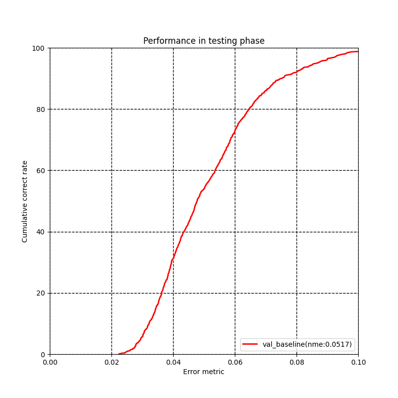

# CVPR 2021 Person in Context Workshop Challenge
## 3D face reconstruction from multiple 2D images

## Requirement
* Python >= 3.6 
* PyTorch >= 0.4.1
* OpenCV (Python version)

## installation structions
 pip install -r requirements.txt 

## Run the test code
### Get val set result
```Shell
python test.py --root-path=$test set fold path --test-list=data/val_list.txt --checkpoint=models/baseline.pth.tar
```

### Cal NME and draw ROC
```Shell
cd evaluation
python evaluation.py --pre_rst_path=val_baseline.txt
```

<p align="center"></p>

## Licence
This code is distributed under MIT LICENSE.

## Contact
Please contact us if you have any problems during the demo running: <br> 
**pixelai-3dface@service.alibaba.com**
